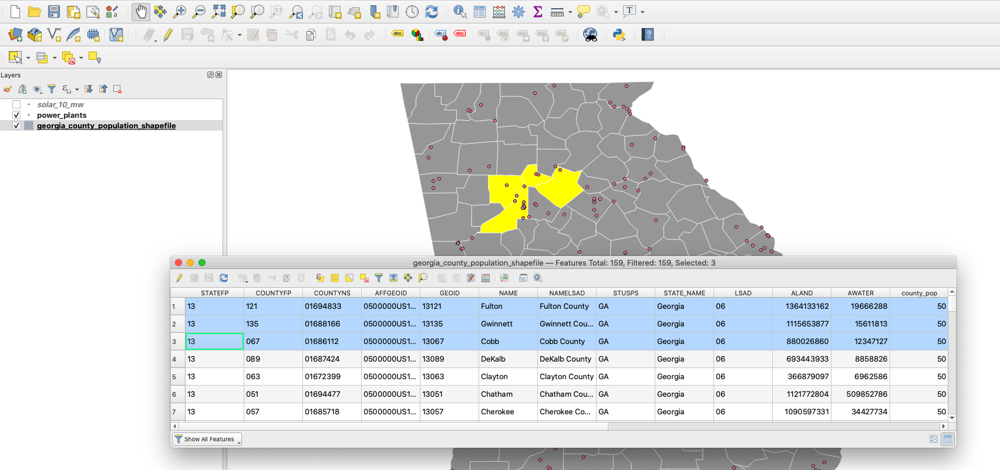

# QGIS II - Filtering and analyzing geographic data to make maps

**Rob England ([@England_Rob_
](https://www.twitter.com/England_Rob_)) & Will Dahlgreen ([@willdahlgreen](https://twitter.com/willdahlgreen)), BBC Data Journalism Team**

*NICAR 2022, 3-6 March, Atlanta, Georgia*

## What are we going to cover?

This workshop should build on your existing knowledge of QGIS and show you how to filter and analyse geographic datasets using queries, before familiarising yourself with exporting the maps you have created using the print composer.

To explore these techniques we're going to be working with a dataset from the Department for Energy data on Power Plants in Georgia, as well as the county level shapefiles and cities data you may have seen in the QGIS I workshop.

This class is ideal for those who attended the QGIS I workshop or already know the basics of visualising geographic data in QGIS. We will cover techniques like writing queries to filter your data, aggregating data for easier analysis, adding labels to your map before exporting as well as using Open Street Map data in QGIS. 

This session is good for: People with some experience in plotting geographic data on a map and some experience with open source mapping software QGIS.

For this tutorial, we will go through the following:

* [Filtering shapefiles](#filtering-shapefiles)
* [Selecting data by location](#selecting-data-by-location)
* [Adding labels to your map](#adding-labels-to-your-map)
* [Tips and tricks when exporting your map](#tips-and-tricks-when-exporting-your-map)
* [Aggregating data: Points in polygons](#aggregating-data-points-in-polygons)
* [Add Open Street Map data to your map: Quick OSM](#add-open-street-map-data-to-your-map-quick-osm)

### What data are we using?

The data we are using in this workshop can be found and download here:
https://www.dropbox.com/sh/bhxde5v033181l6/AACUejjHaLwEdxGYiQvOhzBna?dl=0

You can go through the introduction class, QGIS I, here:
[bit.ly/qgis1_nicar](https://docs.google.com/document/d/13LMw_nSkbels9-Y2zQZKbyoZtfGnAE7dJLZnCuaSnJY/edit)  

## Filtering shapefiles

For this first exercise, let's load in our counties `georgia_county_population_shapefile.shp` shapefile into QGIS. 

You can do this either by dragging the `.shp` file into QGIS or by going to the QGIS Menu bar, selecting `Open data source manager > Vector`, then browse to the shapefile in the folder of the same name, which is inside the `geography` folder.

 

 

Let's then give it a bit of contrast by double-clicking the shapefile and in the `symbology` tab selecting `gray 3 fill`.

 

You will find that there will be times when you only want to use a portion of the data included in your shapefile.

For example in our case, we have a shapefile with all counties in Georgia (`georgia_county_population_shapefile.shp`), but say we just want to look at the county with the highest population (as of 2020), Fulton.

As with most things in QGIS, there is more than  one single way to filter your data, so if you come across another way or are used to working in a different process, then that completely fine. 

So make sure you have the counties shapefile selected in the Layers panel, as in the screenshot below. 

Once you have that, right click on the shapefile and click on the `Filter` option. 

The shortcut for this is `(⌘)F` in mac or `Ctrl+F`  in Windows.

Once you select the Filter option, you should get a popup screen that looks something like this. 

This Query Builder is a powerful tool and something experienced QGIS users will often use to query and filter as they explore their data before making a map.

The `Fields` column essentially displays all the columns in your shapefile data, if it helps to think about a shapefile as an Excel spreadsheet, which you can see if you right click on your layer and click `Open Attribute table` . This is the data that comes for each feature in your shapefile layer. 

But you can look at the data that each Field contains directly in this Query Builder. As mentioned earlier, what we want to do is filter the counties shapefile so that we are seeing just ‘Fulton’ county and disregard all others. So we want to find the field with the county names and select Fulton county. 

Looking at all the Fields, a safe bet to filter by name would be using the `NAME` column. 

In our `Fields` column, lets select and double click the `NAME` option. 

So what this does, as you can see above, is that it populates the space where we are meant to write our query with the text `"NAME"`. Now if we click on the `All` button just below the `Values` block, it will populate the `Values` section with the name of each of the counties that are included in our shapefile. 

As the text in the block below the title `Provider specific filter expression` is essentially a space for `SQL` statements, we need to have an operator after our `"NAME"`. So after name, we should click on the `=` operator. 

So the last step is to find Fulton county in our list of county names. It looks like the names are in alphabetical order, so we could literally scroll down to find Fulton county or we could type it in the values box. Once we have found it, if we double click it, it will populate the query section and our query should be now complete. 

Before you click on OK and run this filter query, you can actually test how many features (in our cases counties) this query will capture and check that this is the result you expected.

To do this, just click the `Test` button at the bottom left of your Query Builder window.

This is the reply you should get - which is exactly what we want, that our result is one county, `Fulton` county!

And if we now do press OK in our Query Builder,  our counties layer should now display just Fulton county.

Success!

Filtering in QGIS is a very powerful tool as it enables you to run a whole host of queries on your data, not just select a feature by name as we have done above. With discrete data, you can filter by category or with numeric data you can filter by any mathematical operations or values.

This technique works just as well with datasets which use polygons or points that we can layer on top of our shapefile, which is what we'll show you now.

Firstly, click the filter button you can see by our shapefile, then select `clear` in the Query Builder, that'll give us back the counties we filtered out previously.

Now bring in the power plant dataset (`power_plants.csv`) by going to the QGIS Menu bar, selecting `Open data source manager > Delimited Text` and browsing to it in the `data` folder. 

This includes point data for power plants in Georgia by energy source. It includes all plants with a combined total capacity of 1 megawatt or more that are operating, on standby, or are temporarily or permanently out of service as of August 2021.

It should automatically populate the X and Y field, but if not you'll need to fill these with longitude and latitude.

Looking at this dataset using `Open Attribute table` again, it has a number of columns with the different characteristics of each power plant. For example, there is a **primary_source** column which describes the type of power plant it is (solar, nuclear etc), as well as as a column describing whether they are a utility company or organisation, or an independant power producer, **sector_name**. 

There are also numeric columns, such as the **total_MW** column that details the capacity of each plant in megawatts, and the type of energy being produced is broken down in subsequent columns.

So given what we know about the data, we can run a more complex filter query and can choose to show power plants based on the following criteria:

- run by utility companies (Electric utility)
- Solar or Solar Thermal
- Produce above 10MW 

Here is the query we will run:  

`("sector_name" = 'Electric Utility')  AND ("primary_source" = 'solar')  AND ("total_mw" > 10)`

When we run our query to include all power plants that satisfy the criteria set above, we get just seven power plants and a map that looks much less crowded - and potentially more meaningful to us depending on the story we are trying to tell or the data we want to investigate.

Now if we wanted to actually save out this filtered selection as a new file and only work with the selected data so that we do not have to load and import the entire dataset, all you need to do is right click on the layer while it is filtered and click `Export > Save Features As…` 

What that will then do is give you a new popup screen where you can set your new file name, where you want to save it as well as the file format, so depending on what you plan to do with it, you can save it as a CSV a Shapefile, a KML etc. 

So now you should be able to not only filter geographic data you have brought into QGIS but also do so using a complex query to filter on a number of criteria, before saving out your filtered dataset into an entire new file to work with.

## Selecting data by location 

Another thing you can use QGIS for is to select data by its geographic location.

So say we want to select power plants located in a few select Georgia counties.

The difference of selecting by location to the filtering we did earlier is that we are selecting data in **one dataset**, the power plant data, based on the geographic location which comes from **another dataset**, the county shapefile. 

So in order to select just the power plants in the Fulton, Gwinnett and Cobb counties we have to first select them in our `georgia_county_population_shapefile.shp` layer. 

Now there are a number of different ways to select features from a layer in QGIS. You can select them manually, or by drawing a shape around them from the `select features` tool in the QGIS toolbar if you want to select them by eye for example (as seen below). 

Another way is by opening the attribute table of the shapefile and ‘look under the hood’ so to speak. 

We can do this by right clicking on our shapefile and selected the `Open Attribute Table` option the way we did it earlier, like so:

This should open a popup for you with the attributes and data for each feature in our `georgia_county_population_shapefile.shp` shapefile. 

In the Attribute table, clicking on the ID of each feature on the left side will select that polygon in the map. 

If you hold the `(⌘)` button on Mac or `Ctrl` in Windows and then click on the ID you can select more than one polygon at a time.

Additionally, once we are in the Attribute table popup, we can actually select features in our shapefile by using a query/expression in a similar way to the filtering we did earlier.

If we click on the `Select features by expression` option (highlighted in screenshot above) in the toolbar of the attribute table, this will launch the Expression builder popup, which is not hugely different from the filter popup we worked with above.

The expression builder is very powerful and enables you to do a lot of complex mathematical operations, not just simple queries. In our case, we want to open up the `Fields and Values` where we can see all the columns in our data. If we double click on the column we want to use, in our case the `NAME` column and similarly to how we wrote the query above to filter our data, we can write a query to select the three most populous counties, Fulton, Gwinnett and Cobb.

Here is the query we have included in the Expression box:

 `"NAME" = 'Fulton' OR "NAME" = 'Gwinnett' OR "NAME" = 'Cobb'` 

If you then click on the `Select features` button at the bottom right of your popup box, the three counties in question should be selected (highlighted in yellow) on your map view. 

So now that we have selected our three counties, the fun bit! How can we select only the power plants located here?

With our three counties selected, by going to the Vector menu in our QGIS menu bar, we should pick the Select by Location option from the Research Tools options, like below:

 `Vector > Research Tools > Select by Location…`
 

On making that choice, you get a popup so that you can make the right selection. What we want to do is select features from our power plant point dataset that `are within`  the counties shapefile, so we modify the options in our Select by Location popup to reflect that, as you can see below. 

The last thing is that we we want to ensure that the `Selected features only` option is ticked, so that only the power plants in our selected counties will be selected. We have also selected to create a new selection and then we can press `Run`.

What you should now see after clicking Run is that all the power plants in these three counties alone are now highlighted yellow, so you can tell that the have been selected. 

In order to save these in a new file, whether you want to save it out as a Geojson, shapefile or CSV, all you need to do is right click on the `power_plants` layer, got to `Export > Save Selected Features As…`. Make sure you click on save **selected** features, otherwise it will just save all the features (points) in the dataset. 

Give the new shapefile a distinctive name, we've gone for `three_counties_data`.

Awesome, you have now created a new shapefile with just the power plants that are in those three counties!

## Adding labels to your map

Using the same Georgia counties shapefile as above with our power stations data on top, we can start adding some labels. 

At first you might want to simply add a label for every power station. Do this by double clicking our most recent creation `three_counties_data` (or right click on it and hit `Properties`) and head into the `Labels` tab.

Select `Single labels` at the top and then choose the column in the data that should generate the labels: `Plant_Name`. You can also change the font style and size in here. Click `OK`.

However, this is a bit messy! 

If we were doing a story on one type of power plants we’d want to add criteria for our labels, by displaying them just for solar power plants, say. To do this go back into your layer properties and in the labels tab choose `Rule-based labeling` at the top. Add a new rule by clicking the `+` sign in the bottom left, then in the `Edit rule` window that pops up automatically (or by double clicking the rule you made) give your rule a name. 

Click the `∈` sign to get to the `Expression String Builder` and when that opens expand the `Fields and Values` section and double click the column we want to use as a criteria: `primary_so`. This will place it into the expression builder but we also have to set what value `primary_so` must be equal to in order to display a label. Click `all unique` and you’ll see the unique values of that column. Press or type the equals sign where the expression is being written and then double click the value we want: `solar`. Click `OK`.

Click `OK` to get out of the other windows too and you should see your filtered labels on the map: 

You might also want to add a background to the labels so they can be seen over land areas. Double click on the rule you created in the properties window of the power stations layer, and edit this in `Background`. 

You can also draw an outline around the text specifically in the `Buffer` tab.

If the text is quite long you can also go into the `Formatting` section to make labels wrap onto multiple lines after a certain amount of characters.

For this try wrapping lines to nine characters, this moves the label on to three lines.

At the moment the labels are a bit bunched up, so let's try to sort that.

In the `callouts` section, in `style` select `Manhattan lines`. This draws a vertical and horizontal line to the point.

Under `label anchor points` select `Top Centre`, this refers to the path the lines will take.

However, not much is showing yet, as we haven't changed the local of the label. Under the `Placement` tab, make sure the `mode` is set to `cartographic` and adjust the `distance to `-20.0000`. 

This offsets the label from the point along the trajectory you set in the `callouts` section.

## Tips and tricks when exporting your map

Print composer is where you go to get a map ready for publication. It allows you to add titles, scales, sources and then export them as a SVG or PNG. Using the power stations map that we labelled above, find `New Print Layout` under `Project` and in the box that pops up give it a name. Naming the print layout allows you to open it up again when the project is saved.

Once the print composer window has opened, add the map by clicking ``Add Map` in the toolbar on the side. Draw a box on your canvas and the map, as it appears back in the main QGIS window, will be added. 

Try and get your map to look how you want it to in the main QGIS window, then come back to the print composer and click `Set to map canvas extent` in the `Item properties` toolbar on the right. This will get the print composer to reflect your changes. By default moving the box with the map in will move the box but not its contents. To move the contents, click `Move item content` in the toolbar on the left.

If you want to increase the size of the map within the box you've drawn you can adjust this in `scale` in the `item properties` tab on the right side. Lowering the number will increase the size of the map, and increasing it will do the opposite.

If you want to manually move the map around the box, you can do this by selecting the `Interactively edit map extent` option in the same tab.

The default tends to be a landscape map, but sometimes you'll want more of a portrait image. To adjust this, right click on a blank area of the layout and select `page properties`.

Here you can adjust the width and height of the page.

To add a title click `Add Label` on the toolbar and draw a text box on the main canvas. Make sure you have selected the text box (select items by clicking the arrow button on the left hand toolbar) and then to edit the text write your title in the `Main properties` section of the label’s `Item Properties` on the right. To change the font size or style click the `Font` box under `Appearance` and a `Text Format` box will appear.

Reposition the map a bit using the steps above to give yourself room for a scale bar and source too. 

To add the scale bar, click `Add Scale Bar` from the toolbar and drag it to where you want it. Once it’s selected you can change the number of points by editing the settings in `Segments` on the right toolbar (making these `left 0` and `right 4` will give you 0-400 with 4 intervals). You can also change the font by expanding the `Fonts and colors` section and double clicking the box that says `Font`.

To add a source, repeat the steps above on creating a title but lower the font size a bit. Move it to the bottom and then draw a line above it by clicking `Add Item` > `Add Shape` > `Add Rectangle`. Drag this across the width of the canvas and make sure it’s not got any depth, so it looks like a line rather than a box. If you find it hard to select the line using the cursor once it’s created because it’s so thin, select the `<rectangle>`  item it in the `Items` panel in the top right instead; from there you can set the style under the `Main properties` section on the right.

 
 

To add a logo to your map click `Add Item` > `Add Picture`, draw a box where you want it and then in the `Picture` section of `Item Properties` on the right browse to the location of your picture. Select `Raster image` and use the browser to navigate to the IRE logo in the `other resources` folder.

 
[need to add screenshot of logo]

You can now export the map as an image, under `Layout` > `Export as Image` or as an SVG under `Layout` > `Export as SVG` , although the SVG export function is probably better used at an earlier stage, before all the labels etc have been added, so that you can edit the map in Adobe Illustrator, say, and add the extras using Illustrator itself.

 
## Aggregating data: Points in polygons

 
What if you have a lot of point data, and you want to actually make a choropleth map of the number of points in each area? For example in our case, we want to make a map displaying the number of **solar** **power plants** in each of Georgia’s counties?

You could export the data and group it by county for example if you have a counties column in your dataset, or if you don’t you could geocode the data to find the county each point lies within, but we can count how many points are located within each polygon easily within QGIS with a `Count points in polygons` spatial analysis. 

First up, we will select the solar power plants in the same way we explored above, so if we right click the `power_plants` layer and select `Open Attribute Table` and then click the `Select features by expression` icon at top of the toolbar, we can write a query to filter just the plants which have `Solar` in the `primary_source` column.

[need to add screenshot of filter]

And if you click `Select features` at the bottom once you have queried by Solar, you should get something like this, which shows the points highlighted in yellow (selected) that are the Solar power plants.

[need to add screenshot of selected solar power plants]

Once you have selected the power plants you want, the next step to making the choropleth map is to run the `Count Points in Polygon` analysis.

`Vector > Analysis Tools > Count Points in Polygon`

[Add screenshot of points in polygons menu]

When we select that option, we get a popup to select the specific layers we want to look at, the layer for the points we want to count and the layer with the polygons that we want the points to fall within. 

So for our data, the points layer is the `power_plants` and the polygons layer is the `georgia_county_shapefile_population`. The Count field name is automatically filled in for us with the name `NUMPOINTS`, you can change that if you want to. 

Remember given we want to see just the solar power plants, which we selected above, we need to make sure that `Selected features only` is ticked. 

When we click the `Run` button, what this will do is that it will create a new temporary layer which is identical to the counties shapefile but append a numeric column called `NUMPOINTS`, which will have the number of solar power plants in the NUMPOINTS column. 

When you go back to your main QGIS window after the count points in polygons analysis finishes, you will get a new layer called `Count` in your layer window. 

[screenshot of count layer]

To make your choropleth map, you need to double click on the Count layer and make your map as you would normally do (see QGIS I).

`Double click Count layer > Symbology > Graduated`  

Once you select the Graduated option, you can then pick the column which contains the data you want to use for your choropleth map, which we know in our case is the column called `NUMPOINTS`. 

You can then choose the mode you want - have gone for Equal Interval here - and picked five classes, but what you choose is up to you!

Once you click `Classify`, you will get the different classes and colours QGIS has selected for your map based on the input options.

Success! If you then go back to the main QGIS window, you can see your choropleth map where each county is coloured based on the number of solar power plants it has. 

## Add Open Street Map data to your map: Quick OSM

Open Street Map is an open source map of the world built by contributors. There is an API that you can use to get the data as well as a browser-based explorer called [overpass turbo](http://overpass-turbo.eu/), but these can be a bit tricky to use.

Quick OSM is a nice plugin for QGIS that allows you to download OSM data directly into QGIS. You can use it to visualise roads, boundaries, rivers, restaurants and many more things. [We used it to show](https://www.bbc.co.uk/news/world-us-canada-46824649) that there’s actually already a lot of ’wall’ along the Mexican border.

A good place to start is with roads. If you haven’t already installed the plugin, go to `Plugins` at the top, then `Manage and Install Plugins` and type Quick OSM into the search bar and install. Once installed find the plugin under the `Vector` tab, open it up and make sure you’re in `Quick Query` on the left panel. 

When you begin playing around with this you’ll want to make sure that you’re zoomed into a fairly small area and have `Extent of map canvas` selected in the Quick OSM window, as it can take a while to request lots of data. If you’re ready to get a lot of data you can switch that to `Extent of a layer` and choose your layer. 

Select `highway` under `Key` and `primary` under `Value`. There’s a useful taxonomy on the [OSM wiki](https://wiki.openstreetmap.org/wiki/Key:highway) (which is really good). Essentially the order of importance/size of roads is: motorway (ie freeway) > trunk > primary > secondary.  

When downloading roads, you may as well deselect `Points` in the `Advanced` section as this is just another lump of data to download that we don’t really need (it’s just the points where roads connect). It’s also worth adding a directory and file name for the data as QGIS could crash, forgetting your layer if it’s only temporary layer.

[can also deselect `Node` and `Relation` on the left. Along with `Way` these are the three fundamental elements in OSM and we only need Ways, which are essentially lines]

Hit `Run query` once your QuickOSM window looks like this:

After you’ve run that on both motorways and trunks (here I’ve also got state boundaries by setting the `Key`  as `admin_level` and `Value` as `4` - [wiki here](https://wiki.openstreetmap.org/wiki/Tag:boundary%3Dadministrative#admin_level)) you should have something like this:

**Bonus extra:**

It seems that if you’re trying to download too much data Quick OSM just says there isn’t any, so in case you need to download a really large amount of OSM data you can find it in [zip files broken down by areas of the world](http://download.geofabrik.de/index.html). You can download it as a shapefile (but these are huge) or a .pbf to save time/space. If you go for .pbf you will need to convert it to a spatialite database (.db) in the command line using ogr2ogr and extract only the area you need, eg like this:

`ogr2ogr -f "SQLite" -dsco SPATIALITE=YES -spat 2.59 46.58 -1.44 47.07 out.db in.pbf` 

(where `-spat` is the west, south, east, north coordinates of the area within the downloaded data that you want to extract). Then you can add the spatialite layer in QGIS and filter it for the type of data you need, eg get just the motorways by filtering for polylines and `"highways"` `=` `'motorways'`

